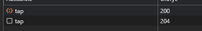
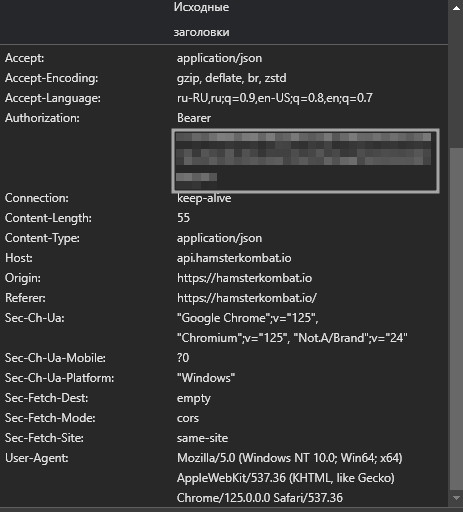

# Автокликер для игры Hamster Kombat

## Что умеет

* Кликает за вас
* Забирает ежедневную награду
* Автоматически берет буст на пополнение энергии
* Автоматически покупает карточки в зависимости от режима покупки

### Как запустить

* Устанавливаем зависимости:

```bash
pip install -r requriements.txt
```

* Создаем файл config.py
* Прописываем в нем:

```python
tokens = ["ВАШ ТОКЕН 1","ТОКЕН ДРУГА","... 3"]

#Никнеймы для токенов
names = ['Имя 1 токена','Имя 2 токена','...']

#Чем выше процент, тем менее выгодные карточки будет покупать бот, рекомендованное значение: 100-150
profit_percent_global = 400
#Ограничение в ценнике
cheap_limit = 100000
#Выбор схемы покупки:
# benefit - Покупать самые выгодные, относительно процента оверпрайса -> profit_percent_global
# cheap - Покупать самые дешевые, ограничение устанавливается переменной cheap_limit
# profit - Покупать сначала с самой высокой доходностью
buy_type = "profit"

```

### Как получить токен

1. Читаем гайд по запуску игры в браузере: <https://github.com/mudachyo/Hamster-Kombat>
2. Входим в аккаунт, открываем игру и открываем консоль разработчика [F12]
3. Ищем блок кода

    ```html
    <iframe src="https://hamsterkombat.io/clicker#tgWebAppData
    ```

    И копируем всю ссылку оттуда (Двойное нажатие по ссылке - выделение), и вставляем её в новую вкладку. Там снова открываем консоль разработчика.

4. Переходим во вкладку сеть и кликаем на главную кнопку, ждем пока появится запрос *tap*

5. Нажимаем на него и на вкладке заголовки ищем *Заголовки запросов*
6. Готово, токен идет после слова *Bearer*  

